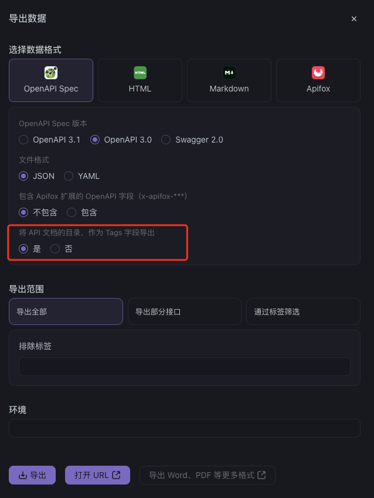

# apifox-ts-gen

> 从 Apifox OpenAPI 规范生成 TypeScript 类型定义

[](https://www.npmjs.com/package/apifox-ts-gen)
[](https://www.npmjs.com/package/apifox-ts-gen)

## ✨ 特性

- 🚀 自动生成 TypeScript 类型定义
- 🌐 支持中文接口名自动翻译
- 🎯 模块化生成，按需选择
- 📝 自动生成 JSDoc 注释
- ⚡️ 支持 ESM 和 CommonJS
- 🛠 灵活的配置选项
- 🔄 支持生成 API 请求服务（可选）

## 📦 安装

```bash
# npm
npm install apifox-ts-gen

# yarn
yarn add apifox-ts-gen

# pnpm
pnpm add apifox-ts-gen
```

## 🔧 配置

创建 `apifox.config.js`：

```javascript
/** @type {import('apifox-ts-gen').ApifoxConfig} */
module.exports = {
  // OpenAPI 规范地址
  url: "http://localhost:4523/export/openapi/2",

  // 输出目录
  outputDir: "src/types",

  // 类型前缀
  typePrefix: "Api",

  // 阿里云翻译配置（可选）
  alibabaCloud: {
    accessKeyId: process.env.ALIBABA_CLOUD_ACCESS_KEY_ID,
    accessKeySecret: process.env.ALIBABA_CLOUD_ACCESS_KEY_SECRET,
  },

  // API 请求服务配置（可选）
  requestConfig: {
    // 请求方法导入路径
    importPath: "@/utils/request",
    // 生成的服务文件存放路径
    servicesPath: "src/services",
    // 类型定义文件导入路径
    typesPath: "@/types",
  },
};
```

## ⚙️ 配置项

| 选项            | 类型     | 必填 | 默认值      | 说明             |
| --------------- | -------- | ---- | ----------- | ---------------- |
| `url`           | `string` | ✅   | -           | OpenAPI 规范地址 |
| `outputDir`     | `string` | -    | `src/types` | 输出目录         |
| `typePrefix`    | `string` | -    | `Api`       | 类型前缀         |
| `alibabaCloud`  | `object` | -    | -           | 阿里云翻译配置   |
| `requestConfig` | `object` | -    | -           | API 请求服务配置 |

### requestConfig 配置项

| 选项           | 类型     | 必填 | 说明                 |
| -------------- | -------- | ---- | -------------------- |
| `importPath`   | `string` | ✅   | 请求方法导入路径     |
| `servicesPath` | `string` | ✅   | 服务文件存放路径     |
| `typesPath`    | `string` | ✅   | 类型定义文件导入路径 |

## 🚀 使用

### CLI 命令行

```bash
# 交互式生成
npx apifox-ts-gen

# 非交互式生成
npx apifox-ts-gen --no-interactive

# 指定配置
npx apifox-ts-gen --url http://your-api-url --output src/types

# 指定模块
npx apifox-ts-gen --modules user,auth,order
```

### 编程式使用

```typescript
import { generateTypes } from "apifox-ts-gen";

async function generate() {
  await generateTypes({
    moduleName: "user",
    tags: ["用户相关"],
    outputDir: "src/types",
    typePrefix: "Api",
  });
}
```

## ⚠️ 重要提示

> 在使用 Apifox 导出 OpenAPI 文档时，请确保勾选 **"将 API 文档的目录，作为 Tags 字段导出"** 选项。如果未勾选此选项，将无法正确获取所有模块信息，导致文档生成失败。

具体设置位置如下图所示：



## 📝 生成的类型示例

```typescript
/**
 * 接口 [获取用户信息↗](/api/user/info) 的 **返回类型**
 *
 * @分类 [用户相关↗](/api/user)
 * @请求头 `GET /api/user/info`
 * @更新时间 `2024-01-01 12:00:00`
 */
export interface ApiGetUserInfoResponse {
  /** 用户ID */
  id: number;
  /** 用户名称 */
  name: string;
  /** 用户角色 */
  role: "admin" | "user";
}
```

## 📄 生成的服务示例

```typescript
import { GET } from "@/utils/request";
import type {
  ApiGetUserInfoRequest,
  ApiGetUserInfoResponse,
} from "@/types/user";

/**
 * 获取用户信息
 * @分类 [用户相关↗](/api/user)
 * @请求头 `GET /api/user/info`
 */
export const getUserInfo = ({
  params,
  config,
}: {
  params: ApiGetUserInfoRequest;
  config?: AxiosRequestConfig<ApiGetUserInfoRequest>;
}) => {
  return GET<ApiGetUserInfoRequest, AxiosResponse<ApiGetUserInfoResponse>>({
    url: "/api/user/info",
    data: params,
    ...config,
  });
};
```

## 📄 支持的配置文件

- `apifox.config.js` (推荐)
- `apifox.config.cjs`
- `apifox.config.mjs`
- `.apifoxrc`
- `.apifoxrc.json`
- `package.json` 中的 `apifox` 字段

## 🤝 贡献

欢迎提交 Issue 和 Pull Request！
